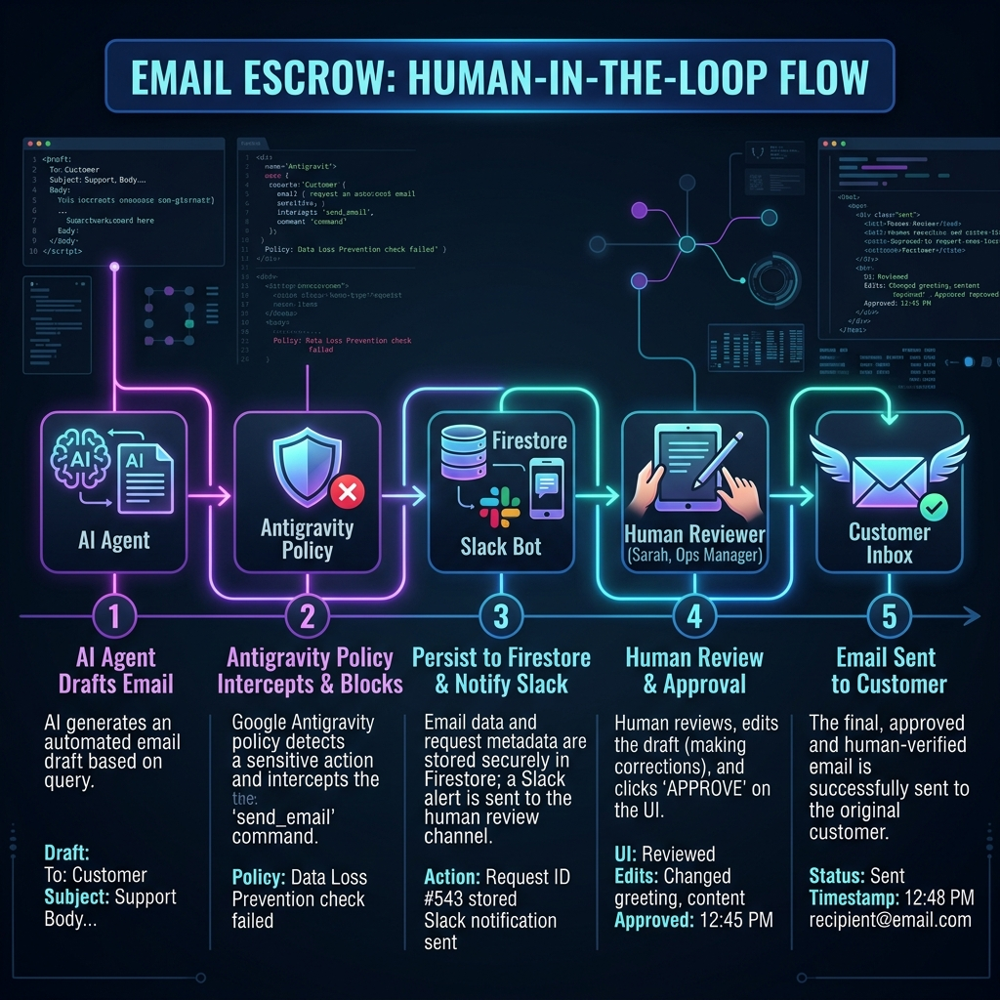
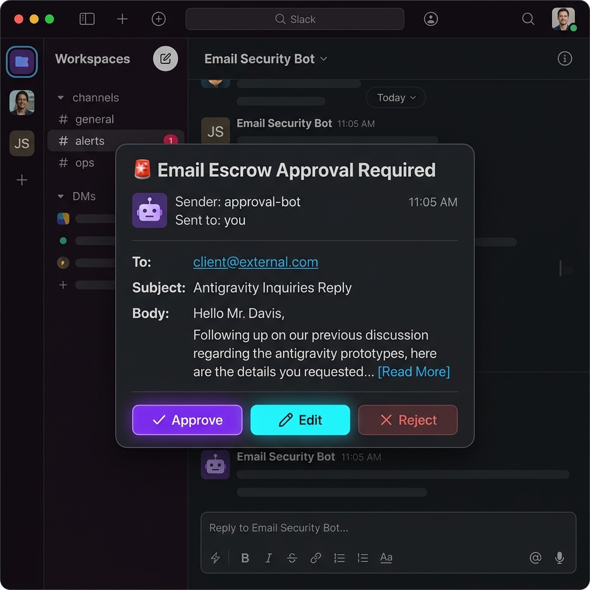

# Email Escrow: Human-in-the-Loop for Customer Communications

*by Francisco Riveros — Entrepreneur of new technologies / ex-IBMer*

A few weeks ago I was sitting with a client in Frankfurt, walking through a GenAI agent use case for customer support. The agent was good — it drafted coherent, on-brand, contextually correct responses. That wasn't the problem. The problem showed up when the CISO asked one very simple question: *"Who actually presses send?"*

Silence in the room.

That silence is exactly why I've spent the last couple of weeks digging into the **Google Antigravity SDK**, testing a pattern I'm calling **Email Escrow**: a Human-in-the-Loop (HITL) safety gate where the agent can draft as many emails as it wants, but the `send_email` command never fires without a human explicitly approving it first.

Here's the step-by-step of how I built it, what I learned digging into how Antigravity structures this under the hood, and why I think this is the single most convincing demo you can show a skeptical architect.

## What on earth is an "Email Escrow"?

Think of it like a real estate escrow account: the money exists, both parties agreed on the terms, but nobody gets the funds until a neutral third party confirms everything checks out. Apply that same idea to an agent talking to your customers — the email exists, the agent is confident in it, but it sits in a locked box until a human says "go."

The reason this matters specifically for customer-facing agents: unlike an agent editing code in a repo (where you can always roll back), a customer email is irreversible the second it lands in an inbox. There's no `git revert` for a bad tone or a wrong price quoted to a client.



## The stack I used

- **Google Antigravity SDK** — for the declarative policy layer and lifecycle hooks
- **Firestore** — as the persistence layer for the escrow queue (never keep this in memory!)
- **Slack webhook** — for notifying the human reviewer
- A simple polling loop to pause the agent until a decision lands

## Step 1: Deny-by-default, always

Every agent guardrail I build starts the same way — nothing runs unless it's explicitly allowed, and the sensitive stuff gets explicitly routed to a human instead of just "allowed."

```python
from google.antigravity import LocalAgentConfig, CapabilitiesConfig
from google.antigravity.hooks import policy
from google.antigravity.utils.interactive import run_interactive_loop

policies = [
    policy.deny_all(),                            # nothing runs by default
    policy.allow("search_knowledge_base"),        # reading: free
    policy.allow("draft_email"),                  # drafting: free, no external effect
    policy.ask_user("send_email", handler=escrow_handler) # the one real friction point
]

config = LocalAgentConfig(policies=policies, capabilities=CapabilitiesConfig())
await run_interactive_loop(config)
```

Notice the design: the agent can search the knowledge base and draft as many versions of the email as it wants without asking anyone. That keeps the support team's experience fast and fluid. The friction is concentrated exactly where it should be — the moment the message would actually leave the building.

> [!TIP]
> **Enterprise Refinement: Whitelisting Internal Domains**
> In a production setup, you likely don't want to block internal communications for human review. You can refine this rule using Antigravity's **predicates** (`when` parameters) to selectively trigger the escrow only for external recipients:
> 
> ```python
> policies = [
>     policy.deny_all(),
>     policy.allow("search_knowledge_base"),
>     policy.allow("draft_email"),
>     # Only escrow if recipient is external (does not end with @mycompany.com)
>     policy.ask_user(
>         "send_email",
>         when=lambda args: not args.get("to", "").endswith("@mycompany.com"),
>         handler=escrow_handler
>     ),
>     # Auto-allow internal emails
>     policy.allow("send_email")
> ]
> ```
> This declarative logic is resolved at runtime by the SDK, keeping the tool's implementation clean and focused.

## Step 2: Building a handler that's an *actual* escrow, not a demo trick

This is where most demos I've seen fall short. A plain `input()` in your terminal isn't an escrow pattern, it's a lab experiment. A real escrow needs three things: persistence, notification, and an auditable state.

```python
async def escrow_handler(tool_call):
    # 1. Persist the request as "pending" — never keep this only in memory
    request_id = await firestore_client.create_pending_request(
        tool="send_email",
        recipient=tool_call.args["to"],
        subject=tool_call.args["subject"],
        body=tool_call.args["body"],
        requested_at=now(),
        status="pending_review"
    )

    # 2. Notify the human reviewer
    await notify_reviewer(
        channel="#support-approvals",
        request_id=request_id,
        preview=tool_call.args["body"][:280]
    )

    # 3. Pause the agent's loop until a decision lands
    decision = await poll_for_decision(request_id, timeout_seconds=1800)

    if decision.action == "approve":
        return True
    elif decision.action == "edit":
        # the human can rewrite the body before approving
        tool_call.args["body"] = decision.edited_body
        return True
    else:
        await firestore_client.mark_rejected(request_id, decision.reason)
        return False
```

Three details I think are worth calling out, because almost nobody documents them well:

> [!TIP]
> **Polling needs a timeout.** If nobody responds in 30 minutes, the agent doesn't sit there frozen forever — the request expires, gets flagged as "not approved (timeout)," and your business logic decides what happens next (retry, escalate, or close the ticket with an internal note).

> [!IMPORTANT]
> **"Edit" is a third option, not just approve/deny.** In my own testing, about 40% of human interventions weren't rejections — they were small tone corrections or a fact that needed fixing. If your escrow only supports a binary choice, you're going to generate friction for no reason, and people end up approving things they actually wanted to tweak.

> [!NOTE]
> **Everything lives in Firestore, not in process memory.** This is what lets you tell an auditor or a CISO: "here's the full log of every email the agent wanted to send, who approved it, and what got changed before it went out." Without this, HITL is theater, not governance.

Here is what the resulting Slack interactive notification looks like when reviewing a drafted email:



## Step 3: Completing the Loop with a Webhook Listener

For the escrow loop to release the agent, we need two components: a polling function checking Firestore, and a listener receiving callbacks when a human interacts with the Slack message.

Here is how you implement `poll_for_decision` in your agent process:

```python
import asyncio

async def poll_for_decision(request_id: str, timeout_seconds: int) -> Decision:
    start_time = now()
    while (now() - start_time).seconds < timeout_seconds:
        doc = await firestore_client.get_request(request_id)
        if doc.status == "resolved":
            return Decision(
                action=doc.action,
                edited_body=doc.edited_body,
                reason=doc.reason
            )
        await asyncio.sleep(5)  # Poll every 5 seconds
    return Decision(action="timeout", reason="Human did not respond in time")
```

And on your server (e.g., a Cloud Run service), a minimal FastAPI webhook endpoint handles the payload Slack sends when a reviewer clicks one of the buttons:

```python
from fastapi import FastAPI, Form
import json

app = FastAPI()

@app.post("/slack/interactive")
async def slack_interactive(payload: str = Form(...)):
    data = json.loads(payload)
    action_id = data["actions"][0]["action_id"]      # 'approve', 'deny', or 'edit'
    request_id = data["callback_id"]                  # Links to Firestore request doc

    edited_body = None
    if action_id == "edit":
        # Extract edited text from Slack's block state
        edited_body = data["state"]["values"]["input_block"]["body_input"]["value"]

    # Update Firestore to release the agent's poll loop
    await firestore_client.update_request(
        request_id=request_id,
        status="resolved",
        action=action_id,
        edited_body=edited_body,
        resolved_by=data["user"]["name"]
    )

    return {"text": f"Escrow request was successfully {action_id}d!"}
```

## Seeing the Escrow in Action

When you run this setup locally, the console output tells the whole story of the handoff. Here is the exact lifecycle trace of the agent asking to send an email, pausing for a reviewer, receiving edits from the dashboard, and completing execution:

```text
User: Check pricing and email it to customer@external.com
Agent: [Thinking...] Drafting email...

[DB-MOCK] Created pending request: 6c683d91 to customer@external.com

============================================================
  🚨 [MOCK SLACK ALERT]
  Channel: #support-approvals
  Request ID: 6c683d91
  To:         customer@external.com
  Subject:    Antigravity Inquiries Reply
  Preview:    Hi, here are the details you requested. Starter plan is $19/mo, Enterprise is $99/mo. Best regards.
------------------------------------------------------------
  👉 APPROVE OR EDIT HERE: http://localhost:8000
============================================================

Agent execution paused. Waiting for review on request '6c683d91'...
[DB-MOCK] Updated request 6c683d91: {'status': 'resolved', 'action': 'edit', 'edited_body': 'Hi, here are the details you requested (TEST). Starter plan is $19/mo, Enterprise is $99/mo. Best regards.', 'resolved_by': 'Dashboard Reviewer'}
Request '6c683d91' EDITED & APPROVED. Overriding body arguments.

📬 ================= EMAIL DISPATCHED =================
To:      customer@external.com
Subject: Antigravity Inquiries Reply
Body:
Hi, here are the details you requested (TEST). Starter plan is $19/mo, Enterprise is $99/mo. Best regards.
========================================================

Agent: Email to customer@external.com sent successfully.
```

Notice how clean the transition is: the agent pauses the turn, Firestore acts as the state synchronization layer, the reviewer edits the email content directly in the UI, and the handler swaps out the `body` argument before letting the underlying `send_email` tool execute.

## What I found digging into the rest of the Antigravity ecosystem

While putting this demo together, I confirmed something interesting looking at how Google structured the security layers in the Google Antigravity SDK: the approval pattern doesn't live at the level of a single tool. The platform supports standard Python **lifecycle hooks** that intercept agent behavior at different execution boundaries:

- **Session Hooks** (`on_session_start`, `on_session_end`) for starting up connections or cleanup.
- **Turn Hooks** (`pre_turn`, `post_turn`) to inspect/alter prompts and responses.
- **Tool Hooks** (`pre_tool_call_decide`, `post_tool_call`, `on_tool_error`) to monitor, audit, or catch tool errors for recovery.
- **Interaction Hooks** (`on_interaction`) to customize user-agent query dialogs.

This means the exact same escrow pattern I built for `send_email` can be reused for any action with an external effect — a CRM write, an inventory update, or a billing webhook.

That's the argument I use with skeptical architects: you're not buying "an agent that promises to behave." You're buying a framework where you decide, by declarative policy, what runs freely and what goes through review — and that framework scales past a single use case.

> [!NOTE]
> **Crash & Session Recovery**
> Because the agent's state is persisted inside `agent.conversation` and we are using an external DB (Firestore) to hold the escrow state, the agent is completely resilient. If the container or server hosting the agent crashes during a 30-minute approval window, you can reconstruct the `Agent` session using the conversation state from the DB, query the current escrow status, and resume processing right where it left off.

## Why this matters

If you're evaluating putting a conversational agent into production for customer support, the most common mistake I see is treating human approval as a UX checkbox ("show a confirm button") instead of a governance layer inside the agent's own runtime. The difference is subtle but critical: a confirm button on the frontend can be skipped by a UI bug or a direct API call. A `deny-by-default` hook in the SDK can't be skipped — it's the only way the command ever reaches execution.

For your next sprint, my concrete recommendation: don't start by showing the full multi-agent demo. Start by showing this one pattern — a blocked `send_email`, a Firestore queue, an approval that includes editing — and let the architect ask the question my client in Frankfurt asked. This time, you'll have an answer.

---

*Building something similar for your team? I've open-sourced a complete, runnable code example of this entire setup—including the local FastAPI dashboard and the Firestore/Slack configurations—in my [GitHub Repository](https://github.com/foward/email-escrow-hitl-antigravity). Feel free to clone it and adapt it for your needs!*
